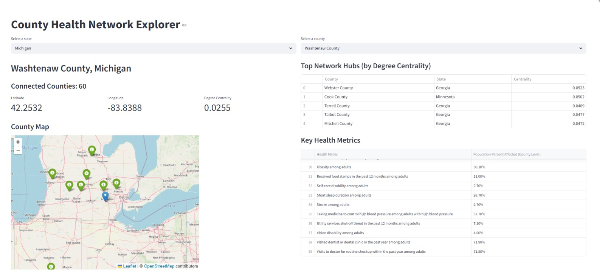
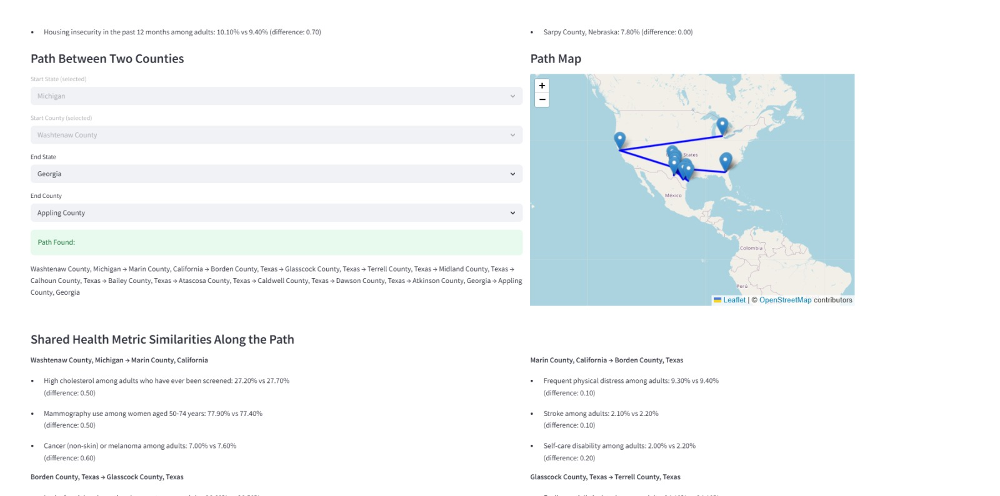

# County Health Network Explorer

The **County Health Network Explorer** is an interactive Streamlit web app designed to visualize and analyze health similarities across U.S. counties. 

*(Note: If you're not seeing all the functionalities of the website right away, reload it! The code and map rendering is a little slow, and can be optimized for future implementations!)*

## Overview

Built on publicly available datasets (CDC PLACES and U.S. geographic data), the app treats counties as nodes in a health-based similarity network. Users can explore connections between counties based on shared health metrics like diabetes prevalence, physical inactivity, and smoking rates.

Key features include:
- **Interactive Maps & Profiles**: View a selected county’s location, profile, and health data in a clean, human-readable format.
- **Similarity Network**: Identify and explore counties with highly similar health profiles (based on cosine similarity).
- **Metric Comparisons**: Compare specific health metrics between a selected county and its connected neighbors.
- **Path Analysis**: Compute and visualize paths between counties across the health similarity network, with metric-by-metric comparisons along each step.
- **Network Insights**: Identify network hubs—counties connected to many similar peers—and find counties most similar in specific health indicators.

---

## Features

- Interactive UI with dynamic county selection
- Scrollable table of detailed health metrics for each county
- Similarity-based network using cosine similarity
- Side-by-side comparison of connected counties
- Search for counties with similar values for a chosen metric
- Pathfinding between counties, showing differences along the way

---

## Data Sources

- [CDC PLACES Dataset](https://data.cdc.gov/500-Cities-Places/PLACES-Local-Data-for-Better-Health-County-Data-20/swc5-untb/about_data)
- [U.S. Counties Geo Data](https://simplemaps.com/data/us-counties)

---

## Installation

1. Clone the repository:

```bash
git clone https://github.com/thelonelyextrovert/us-county-health-network.git
cd us-county-health-network
```

2. Install dependencies:

```bash
pip install -r requirements.txt
```

3. Make sure these CSV files are present in the project directory:
   - `PLACES.csv`
   - `uscounties.csv`

---

## Running the App

To launch the Streamlit application:

```bash
streamlit run app.py
```

---

## How It Works

- Health metrics are normalized using `StandardScaler`
- Cosine similarity identifies similar counties
- Counties are nodes; connections form based on similarity above a set threshold (e.g., 0.9)
- BFS is used to find paths between counties for comparison

---

## Screenshots




---

## Application

You can access the deployed application [here](https://us-county-health-network.streamlit.app/)

## Declaration of AI

I used Github's Co-Pilot to refactor and generate parts of the StreamLit's interface code.

